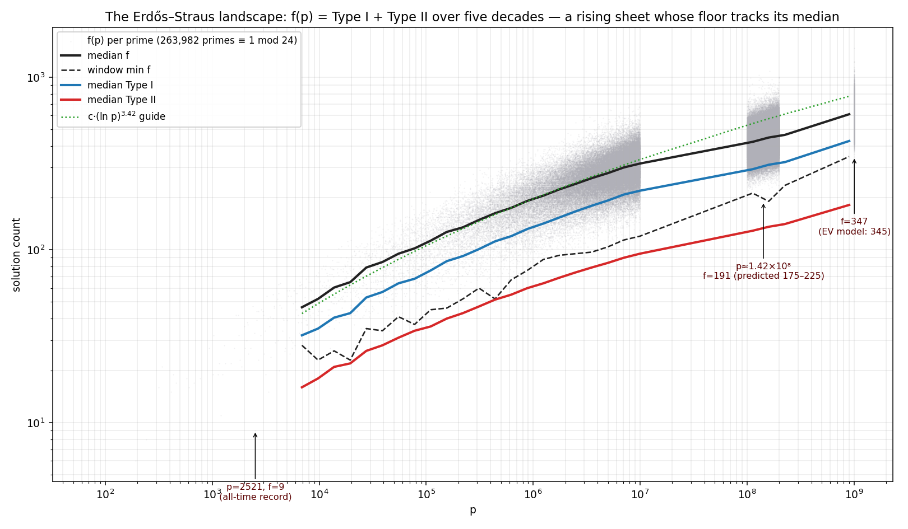
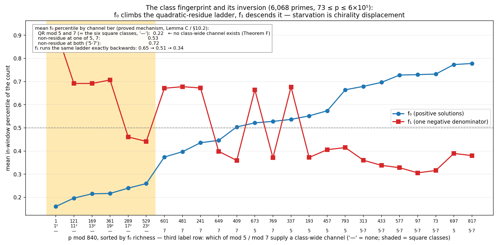
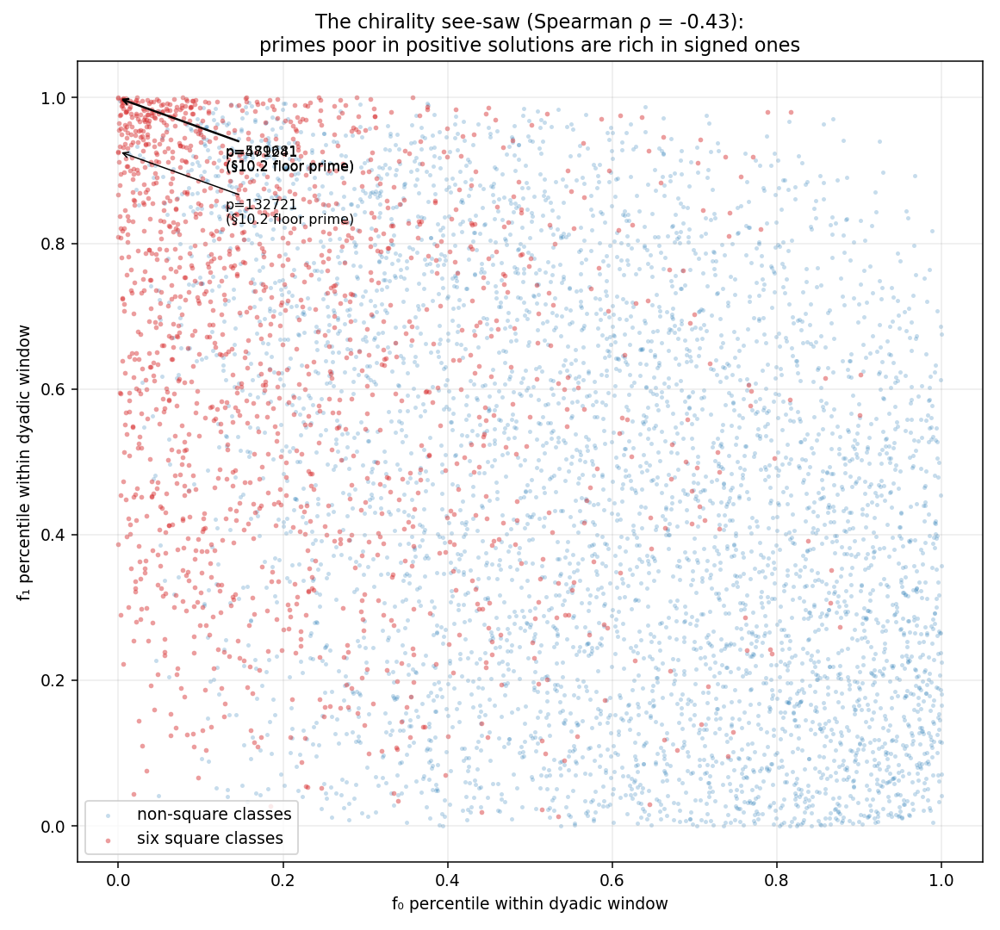
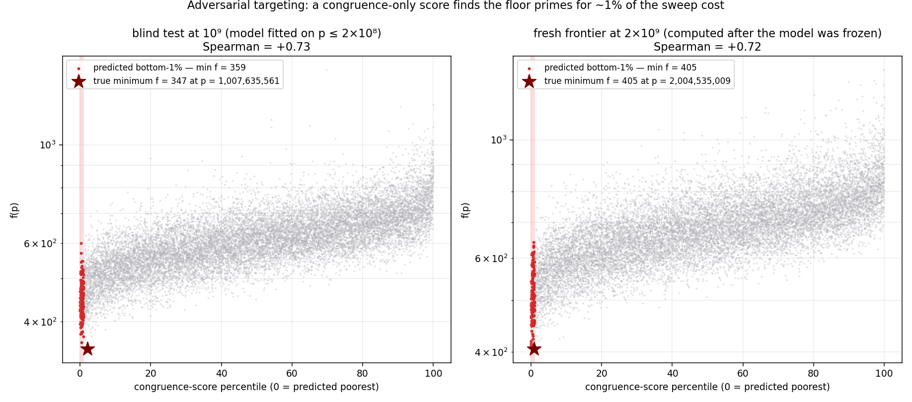

# Erdős-Straus conjecture: An experimental expansion approach

This repository is an effort towards a solution of the **Erdős–Straus conjecture**
(Erdős & Straus, 1948) — by exhaustive computation, machine-verified proof attempts,
statistical law-finding, and a structural extension of the problem to the negative
integers. The conjecture remains **open**; what this project contributes is
measurement and structure: the largest per-prime solution-count datasets we are aware
of, several empirical laws confirmed by blind prediction, a set of machine-verified
theorems locating exactly *why* the elementary toolbox cannot close the problem, and
the first quantitative study (to our knowledge) of the conjecture over ℤ.

## The conjecture

> For every integer n ≥ 2 there exist **positive** integers x, y, z with
>
> 4/n = 1/x + 1/y + 1/z.

It suffices to prove it for primes. Solutions are known to exist for every n except
possibly primes in the six "square classes" p ≡ 1², 11², 13², 17², 19², 23² (mod 840),
where every covering-congruence identity provably dies (Mordell, Schinzel). The
conjecture has been verified up to 10¹⁷ (Salez 2014; a 2025 preprint claims 10¹⁸).
See [References](#references) for the canonical statements.

## Abstract

We study f(p), the number of unordered solutions of 4/p = 1/x + 1/y + 1/z, across
278,570 primes of the hard residue classes from 73 up to 2.01×10⁹ — beyond the largest
published per-prime dataset (3.5×10⁷) — using four independently written engines
(C, Rust, CUDA, Python) that agree byte-for-byte at five scales and reproduce the
published external dataset with zero discrepancies. Empirically, ln f(p) is
window-normal with shrinking dispersion; its extreme-value consequences predicted the
minima of three then-uncomputed ranges blind (min f = 191 ∈ [175, 225] at 2×10⁸;
347 vs 345 at 10⁹; median 681 exact and min 405 vs [351, 404] at 2×10⁹). A
machine-verified proof-attempt section re-derives the square obstruction in full,
proves an ε-covering theorem (identity families can approach but never reach full
coverage, at cost T ≈ exp(ε⁻²)) and a no-finite-channel-system theorem, locating the
precise wall: a pointwise lower bound for divisors of shifted integers in prescribed
residue classes, available today only on average.

Extending the problem to **negative integers** — this repository's guiding question —
collapses it (two signed unit fractions always suffice; the failure sets of the two
2-term forms are exactly complementary) and reveals the conjecture to be a *chirality
statement*: the solution set is graded by the number of negative denominators, the
negative-n axis is an exact mirror, the square obstruction lives only in the
positive-sign sector, and the "starved" hard classes are the *richest* in
one-negative solutions (rank correlation −0.43; the record prime p = 2521 has 9
positive solutions and 684 signed ones). Finally, the lognormal residual itself
decomposes: ≈58% is a congruence ladder obeying a measured decay law
s_q ≈ 18·q^−1.95 (non-residues richer at every modulus, as the obstruction theory
predicts), ≈42% is factorization noise — and the maximally hostile congruence
configuration reaches only 10% of the depth a counterexample needs. A congruence-only
score built from the ladder ranks the f-landscape at 10× its fitting range
(ρ ≈ +0.72) and locates window floors for ~1% of sweep cost — an instrument for
adversarial searches at scales where exhaustion is impossible.

None of this proves or disproves the conjecture — the project's own theorems explain
why this toolbox cannot — but the laws, datasets, and the signed-world structure are,
as far as a careful literature search could establish (2026-06; we could not access
MathSciNet/zbMATH), not previously recorded.

## Methodology

The project's rule: **no claim without a machine check, no engine without independent
validation, no model without a blind test.**

- **Validation-first computation.** Four engines written independently:
  `files/fp.c` (C), `files/fpr.rs` (Rust), `files/fp.cu` (CUDA, RTX 5090),
  `files/fsigned.c` (C/OpenMP, signed grading). Byte-identical outputs at five scales
  (2×10³, 10⁶, 3.5×10⁷, 10⁸, 2×10⁹), against a blessed hand-validated reference, and
  against the independent published dataset of arXiv:2509.00128 on 22,662 overlapping
  primes — zero mismatches anywhere.
- **Machine-verified mathematics.** Every numbered claim in the proof-attempt and
  signed-extension sections is checked in exact arithmetic:
  `files/verify_lemmas.py` (8,719 assertions, REPORT §9) and
  `files/verify_signed.py` (536,988 assertions, REPORT §11).
- **Blind prediction protocol.** Statistical models are fitted on small scales,
  frozen, and tested on uncomputed ranges (fits ≤ 2×10⁸; tests at 10⁹ and 2×10⁹,
  stated in the transcript before the runs finished).
- **Exact arithmetic everywhere** (integer/Fraction in Python; `__int128` in C);
  divisor-class enumeration via the kernel described in REPORT §9.1.
- Hardware: i9-9900K (16 threads), RTX 5090 (32 GB). A 10⁷-wide hard-class slice at
  2×10⁹ takes ~46 GPU-minutes.
- All sessions were conducted as an interactive human–AI collaboration (direction and
  the extension idea: repository owner; derivations, engines, and analyses: Claude,
  Anthropic — see commit trailers). Every result above is verified by code that does
  not depend on the assistant's reasoning being correct.

## Findings

Full details and tables live in [REPORT.md](REPORT.md); figures in `files/plots/`.

**F1 — The landscape: zero-free, rising, tightening.**
f, f_I, f_II > 0 for all 278,570 computed hard-class primes to 2.01×10⁹; the floor
grows as ~(ln p)^3.4±0.2 at the same exponent as the median; σ(ln f) shrinks
0.30 → 0.144 across five decades. Code: `files/fp.cu`, `files/fpr.rs`,
`files/analyze_final.py`, `files/analyze_session2.py`; data `files/hard_*.csv`,
`files/fresh_2e9_slice.csv`; REPORT §2, §10, §12.5.

**F2 — The lognormal law and its blind confirmations.**
Per dyadic window, ln f is normal to high precision (263,763 primes pooled); window
minima are pure order statistics. Three blind tests hit: [175, 225] → 191 (2×10⁸),
345 → 347 (10⁹), median 681 → 681 exact and [351, 404] → 405 (2×10⁹). The closest
published work fits no distribution to f(p), so this law appears to be unrecorded.
Code: `files/analyze_session2.py`, `files/target_frontier.py`; REPORT §5, §10.3–10.4,
§12.5; figure `files/plots/5_lognormal.png`.

**F3 — The channel decomposition and the class fingerprint.**
f(p) decomposes into congruence "channels"; Mordell's identities are class-wide
channels, and the six square classes are exactly the classes with none. Within
p ≡ 1 (mod 24), mean f₀-percentile climbs a quadratic-residue ladder
(0.215 / 0.526 / 0.724 for QR-at-both-5,7 / NR-at-one / NR-at-both) — and the
one-negative count f₁ descends the same ladder backwards. REPORT §3, §10.2, §11.7;
figure `files/plots/2_fingerprint.png`.

**F4 — The wall, proved in-project (REPORT §9).**
Machine-verified: the kernel bijection (Lemma A); explicit sufficient criteria
(Lemma B) and an infinite channel family (Lemma C); the square obstruction re-proved
in full via two Jacobi-symbol facts (Lemma D); the ε-covering theorem (Theorem E:
coverage 1−ε costs exp(ε⁻²) identities); and Theorem F: **no finite channel system
covers any class containing squares** — so the six square classes can never be closed
by identities, covering congruences, or the circle method. Code:
`files/verify_lemmas.py`.

**F5 — Erdős–Straus over ℤ: the conjecture is a chirality statement (REPORT §11).**
With signs allowed, two unit fractions always suffice (Theorem G), and the failure
sets of the sum-form and difference-form are exactly complementary — the hard class
of one world is the easy class of the other. The solution set is graded by the number
of negative denominators; the grading is pure window-position inside the *same*
divisor classes (Lemma H); negative n is an exact mirror (Theorem J); the square
obstruction is chiral — it empties only the positive windows (Lemma K); and no
channel system can flip chirality (Corollary L). Empirically the §10.2 starvation law
*inverts* in the signed sector (f₁ window minima land in square classes 0/7 vs 7/7
for f₀): **channel starvation is displacement of solution mass into the other
chirality, not absence** — f̃(2521) = (9, 377, 307). Counting signed representations
appears to be entirely unstudied (no literature, no OEIS sequence as of 2026-06).
Code: `files/verify_signed.py`, `files/fsigned.c`, `files/census_ref.py`,
`files/analyze_signed.py`; data `files/signed_*.csv`; figures
`files/plots/3_seesaw.png`, `files/plots/4_strata.png`.

**F6 — Inside the residual: 58% ladder, 42% factorization (REPORT §12.1–12.3).**
After removing the window trend and mod-840 fingerprint, the residues p mod q still
predict ln f at every prime modulus q ≤ 199, non-residue side richer — Theorem F's
sign at every modulus — with measured decay s_q ≈ 18·q^−1.95 and out-of-sample
saturation at ≈58% of the variance. The remaining ≈42% carries the factorization
statistics of the shifted integers 4pm+1. Maximally hostile congruence reaches only
**10%** of the depth a counterexample needs (Δln f −0.66 of −6.41): a counterexample
would have to be a large-prime factorization conspiracy, not a congruence event.
Code: `files/residual_spectrum.py` (writes `files/residual_effects.json`); figure
`files/plots/6_spectrum.png`.

**F7 — The adversarial frontier (REPORT §12.4–12.5).**
A congruence-only score fitted at ≤ 2×10⁸ ranks f at 10⁹ and 2×10⁹ with
Spearman ≈ +0.72 and finds window floors from within its predicted bottom-1% — at
2×10⁹ it found the exact floor (f = 405 at p = 2,004,535,009 ≡ 13² mod 840) for ~1%
of the sweep cost. This is the search instrument for ranges beyond 10¹⁸ where
exhaustive verification is impossible; its honest limit: the unexplained 42% decides
individual primes, so targeting compresses a search but only enumeration certifies.
Code: `files/target_frontier.py`, `files/plot_residual.py`.

## The expanded logic: negative integers, and the structures they reveal

The extension driving the 2026-06-12 sessions was a question posed by the repository
owner: *what happens to the conjecture if negative integers are allowed — does it
still hold, and what patterns appear in the negative domain?* The answers turned out
to be structural, and they reorganize the whole problem:

1. **The graded count vector.** Over ℤ* the natural object is not one number f(p) but
   the vector (f̃₀, f̃₁, f̃₂, f̃₃)(n) — solutions graded by how many denominators are
   negative (trivial cancelling triples {t, −t, n/4}, which exist iff 4 | n, are
   excluded). The classical f is the grade-0 component; the conjecture is f̃₀ ≥ 1.
2. **An even function with a grade flip.** Negation gives f̃ₖ(−n) = f̃₃₋ₖ(n), so the
   total F̃ = Σ f̃ₖ is an *even* function on ℤ — the negative axis is an exact mirror
   and adds no new conjecture. The conjecture over ℤ reads: *the even function F̃
   keeps its grade-0 component positive on the positive axis.* That is what "Erdős–
   Straus is a chirality statement" means. (n = 2 is the unique "signless" point:
   F̃(2) = f(2) = 1; f̃₁ = 0 exactly at n ∈ {2, 4}.)
3. **The window dictionary.** All grades live in the *same* arithmetic object: the
   divisor classes d ≡ −nx (mod 4x−n) of the classical kernel. The grade of a
   solution is purely the *window* its divisor lands in (positive window → f̃₀,
   negative windows → f̃₁, mirror-modulus window → f̃₂). Positivity — the entire
   content of the conjecture — is geometry inside a residue class, not a different
   equation.
4. **A third mechanism.** The signed windows admit a stratum that provably cannot
   exist in the positive world ("Type III": p² divides the window divisor). At the
   record prime 2521 it is the *largest* stratum (177 of 377 one-negative solutions).
5. **The chirality of the obstruction, and the see-saw.** The Jacobi-symbol
   obstruction that makes the conjecture hard kills only the positive windows
   (Lemma K); the same arithmetic that empties a prime's positive window fills its
   negative ones — measured as corr(f̃₀, f̃₁) = −0.43 overall and −0.22 within
   residue classes. The hard classes are not poor; they are *polarized*.

So: the conjecture survives the extension trivially (two signed terms always
suffice), and the extension pays for itself by exposing the data structures —
grading, evenness, windows, strata — in which the original difficulty becomes
geometrically visible: everything hard about Erdős–Straus is the statement that the
positive window always gets its share.

## Repository map

| Path | What it is |
|---|---|
| `REPORT.md` | The full study: §0–§8 landscape + laws, §9 proof attempt, §10 datasets, §11 signed extension, §12 residual + frontier |
| `TRANSCRIPT.md` | The original phone-session log that started the project |
| `files/fp.c`, `files/fpr.rs`, `files/fp.cu` | The positive-world engines (C / Rust / CUDA) |
| `files/fsigned.c`, `files/census_ref.py` | The signed-grading engine + Python reference |
| `files/verify_lemmas.py`, `files/verify_signed.py` | Machine verification of §9 / §11 (8,719 / 536,988 assertions) |
| `files/residual_spectrum.py`, `files/target_frontier.py` | §12: the spectrum + the adversarial score |
| `files/analyze_*.py`, `files/plot_*.py` | Analyses and the figure atlas (`files/plots/1–7`) |
| `files/hard_*.csv`, `files/fresh_2e9_slice.csv`, `files/signed_*.csv` | The datasets (per-prime counts; graded census) |

Build/run commands are in REPORT §8, §11.9, §12.7. (Plotting note: on this machine
run plot scripts with `PYTHONNOUSERSITE=1` — see `files/plot_types.py` header.)

## Status

**The Erdős–Straus conjecture is open.** Nothing here proves or disproves it — §9
and §12 prove, inside this project's own framework, that identity/covering/channel
methods cannot, and quantify how far congruence structure alone can reach (10% of a
counterexample). Open directions logged at the end of REPORT §12: fold factorization
features into the targeting score, the second moment of the window split, a 10¹⁰
probe (requires auditing the CUDA engine's 64-bit arithmetic), OEIS submission of the
signed sequences, Lean formalization of Lemma D.

## References

**The conjecture**
- Wikipedia: Erdős–Straus conjecture — https://en.wikipedia.org/wiki/Erd%C5%91s%E2%80%93Straus_conjecture
- Erdős Problems #242 (T. Bloom) — https://www.erdosproblems.com/242
- OEIS: A073101 (0 < x < y < z), A192787 (x ≤ y ≤ z — this project's f), A292581 (ordered) — https://oeis.org/A192787

**Principal literature used**
- C. Elsholtz, T. Tao, *Counting the number of solutions to the Erdős–Straus equation
  on unit fractions*, J. Aust. Math. Soc. 94 (2013) 50–105 — https://arxiv.org/abs/1107.1010
- L. J. Mordell, *Diophantine Equations*, Academic Press (1969), pp. 287–290
- A. Schinzel, *On sums of three unit fractions with polynomial denominators*,
  Funct. Approx. Comment. Math. 28 (2000) 187–194
- S. E. Salez, *The Erdős–Straus conjecture: new modular equations and checking up
  to N = 10¹⁷* (2014) — https://arxiv.org/abs/1406.6307
- M. Spiridon, B. C. Dumitru, *Further verification and empirical evidence for the
  Erdős–Straus conjecture* (2025, preprint; the external f(p) dataset cross-validated
  here) — https://arxiv.org/abs/2509.00128
- C. Pomerance, A. Weingartner, *Exceptions to the Erdős–Straus–Schinzel conjecture*
  (2025) — https://arxiv.org/abs/2511.16817
- J. H. Jaroma, *On expanding 4/n into three Egyptian fractions*, Crux Mathematicorum
  30 (2004) 36–37 — the documented trace of the signed variant
- T. Bloom, C. Elsholtz, *Egyptian Fractions* (survey, 2022) — https://arxiv.org/abs/2210.04496
